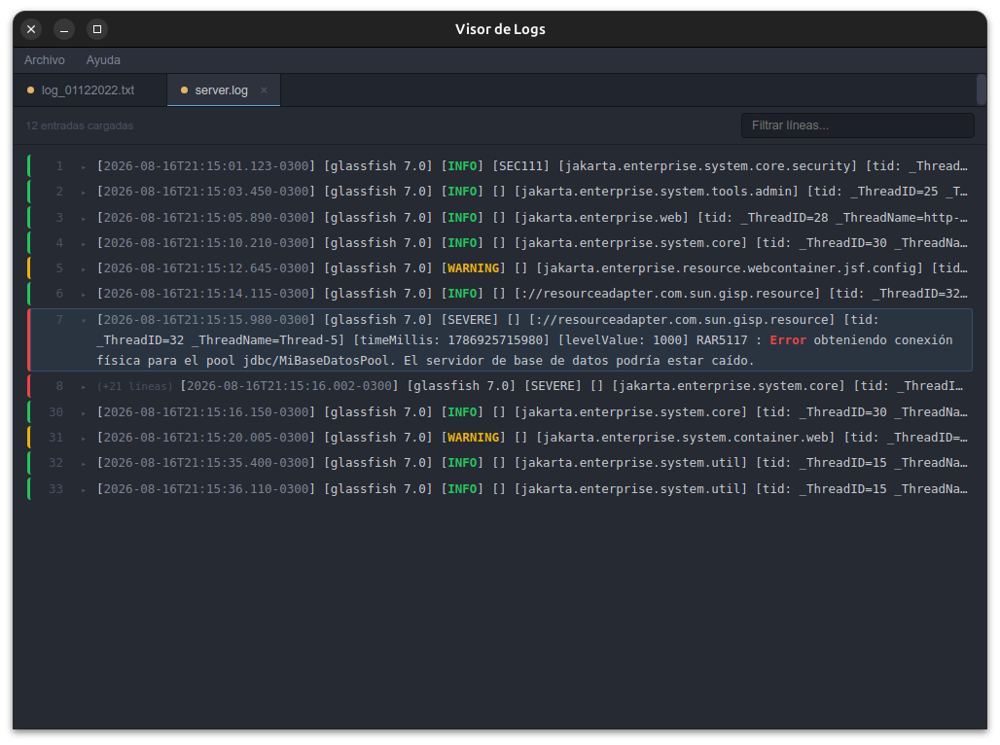

# Visor de Logs



Aplicación de escritorio (Electron) para visualizar archivos de log de Java. Resalta niveles y fechas, agrupa cada mensaje con su stack trace en tarjetas colapsables, permite tener varios archivos abiertos a la vez en pestañas, y filtra el log completo en tiempo real.

Interfaz con estilo inspirado en Sublime Text: barra de menú propia, pestañas por archivo y gutter de números de línea.

## Características

- **Carga de archivos de log** (`.log`, `.txt` o cualquier extensión) desde el menú **Archivo → Abrir archivo de log...** (o `Ctrl+O`).
- **Resaltado de niveles**: `INFO` en verde, `WARN`/`WARNING` en amarillo, `ERROR`/`FATAL` en rojo.
- **Resaltado de fechas y horas** (`YYYY-MM-DD HH:mm:ss`, con milisegundos, formato ISO con `T`/`Z`, o solo hora) en un color celeste tenue.
- **Agrupado por entrada**: cada línea con fecha/nivel inicia una "entrada"; las líneas siguientes sin fecha (p. ej. un stack trace) se agrupan con ella hasta la próxima entrada.
- **Tarjetas colapsables**: todas las entradas (no solo errores) se muestran contraídas por defecto — fecha + primera línea truncada — y se expanden con un clic en cualquier parte de la línea. Cada tarjeta tiene un borde de color según su nivel.
- **Gutter de números de línea** con el número real de línea del archivo original.
- **Pestañas múltiples**: cada archivo abierto queda en su propia pestaña (con su propio filtro y estado de colapsado) hasta que el usuario la cierra con la `×`.
- **Archivos recientes**: los últimos 10 archivos abiertos quedan disponibles en **Archivo → Archivos recientes**, persistidos entre sesiones.
- **Filtro de búsqueda en tiempo real** que oculta las entradas que no coinciden con el texto ingresado.
- **Auto-scroll** hacia el final del log al cargar un archivo.
- **Copiar texto**: clic derecho sobre texto seleccionado muestra un menú contextual con la opción "Copiar".
- **Acerca de**: en el menú **Ayuda**, con una breve descripción de la app.
- Ícono de aplicación personalizado, incluido tanto en modo desarrollo como en los ejecutables empaquetados.

## Estructura del proyecto

```
visor-logs/
├── main.js            # Proceso principal de Electron (ventana, diálogo de archivo, IPC)
├── preload.js          # Puente seguro (contextBridge) entre main y renderer
├── renderer.js          # Lógica de la interfaz: parseo de logs, pestañas, menú, búsqueda
├── index.html           # Estructura HTML de la interfaz
├── assets/
│   └── styles.css        # Estilos de la interfaz (tema oscuro estilo Sublime Text)
├── build/
│   ├── icon.svg           # Ícono fuente (vectorial)
│   ├── icon.png            # Ícono 1024x1024 (Linux / ventana en desarrollo)
│   └── icon.ico             # Ícono multi-resolución (Windows)
├── package.json
└── dist/                # Ejecutables generados (no versionar)
```

## Requisitos

- [Node.js](https://nodejs.org/) 18 o superior
- npm

## Instalación

```bash
npm install
```

## Ejecutar en modo desarrollo

```bash
npm start
```

> En Linux, el comando incluye el flag `--no-sandbox`. Es necesario porque el sandbox de Chromium requiere un binario (`chrome-sandbox`) con permisos `setuid root` que `npm install` no puede configurar automáticamente. Alternativa más segura (opcional): otorgar esos permisos manualmente con
> ```bash
> sudo chown root:root node_modules/electron/dist/chrome-sandbox
> sudo chmod 4755 node_modules/electron/dist/chrome-sandbox
> ```

## Generar ejecutables

La app usa [electron-builder](https://www.electron.build/) para empaquetar.

```bash
npm run dist:linux   # genera un .AppImage en dist/
npm run dist:win     # genera un instalador .exe (NSIS) en dist/
npm run dist:all     # genera ambos
```

- Para compilar el `.exe` desde Linux se necesita [Wine](https://www.winehq.org/) instalado (usado para incrustar el ícono en el ejecutable).
- Los archivos resultantes quedan en `dist/`.

## Uso

1. Abrí la app y andá a **Archivo → Abrir archivo de log...** (o `Ctrl+O`).
2. Seleccioná un archivo de log. Se abre en una pestaña nueva, coloreado y agrupado por entradas.
3. Hacé clic en cualquier entrada para expandirla o contraerla.
4. Escribí en el campo de búsqueda para filtrar las entradas visibles en tiempo real.
5. Abrí más archivos: cada uno queda en su propia pestaña. Cerralas con la `×` cuando ya no las necesites.
6. Los archivos abiertos recientemente quedan accesibles desde **Archivo → Archivos recientes**.

## Detalles técnicos

- **Seguridad**: `contextIsolation: true` y `nodeIntegration: false`; toda comunicación entre el proceso principal y la interfaz pasa por `contextBridge` (`preload.js`) e IPC (`ipcMain.handle` / `ipcRenderer.invoke`). El acceso al sistema de archivos ocurre únicamente en el proceso principal.
- **Sin barra de menú nativa**: se usa `Menu.setApplicationMenu(null)` y en su lugar la interfaz dibuja su propia barra de menú (Archivo / Ayuda) en HTML.
- **Detección de nivel y fecha**: expresiones regulares sobre cada línea (`renderer.js`) para identificar `INFO`/`WARN`/`WARNING`/`ERROR`/`FATAL` y patrones de fecha/hora comunes.
- **Agrupado de entradas**: una línea inicia una entrada nueva si arranca con una fecha/hora o un nivel de log (con o sin corchetes); cualquier otra línea (blancos incluidos) se considera continuación de la entrada anterior, hasta la siguiente.
- **Recientes**: persistidos en `localStorage` del renderer (clave `visor-logs:recentFiles`), máximo 10, sin duplicados.
- **Aceleración por hardware desactivada** (`app.disableHardwareAcceleration()`) para evitar advertencias de VSync de Chromium en entornos sin GPU completa (máquinas virtuales, algunos Linux) — no afecta el funcionamiento de la app.

## Autor

Ángel Giménez — 2026
